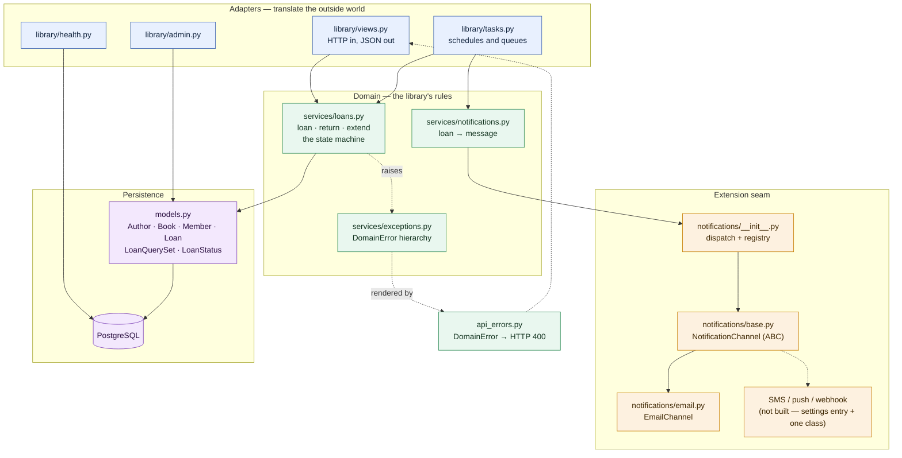
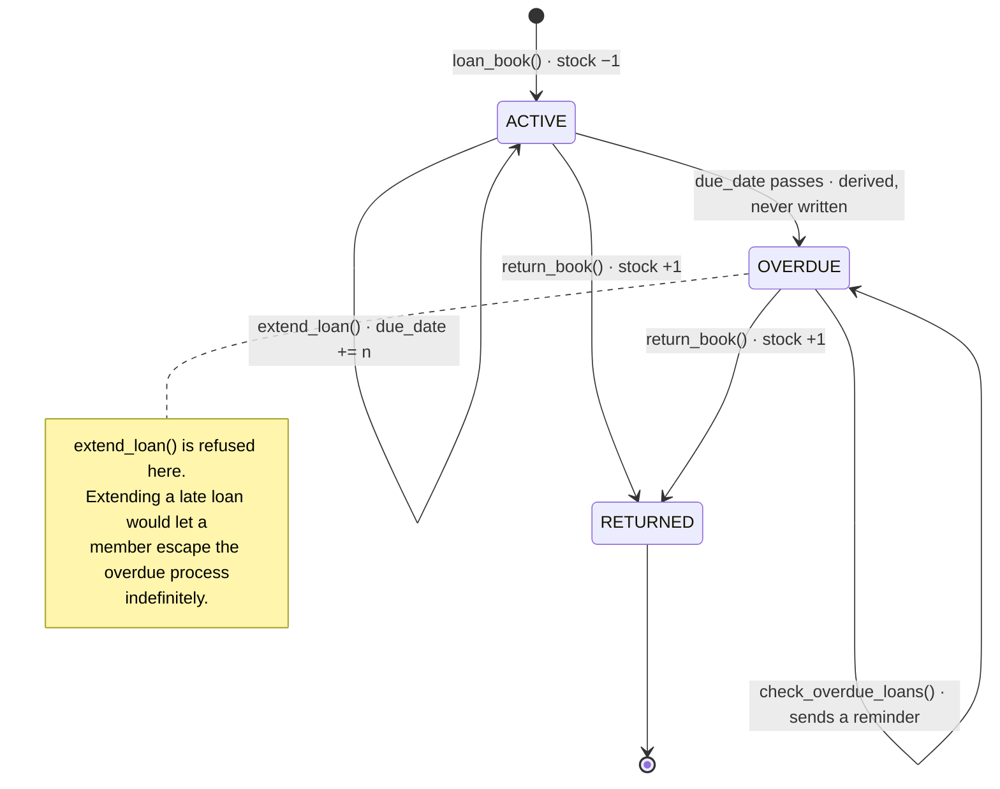
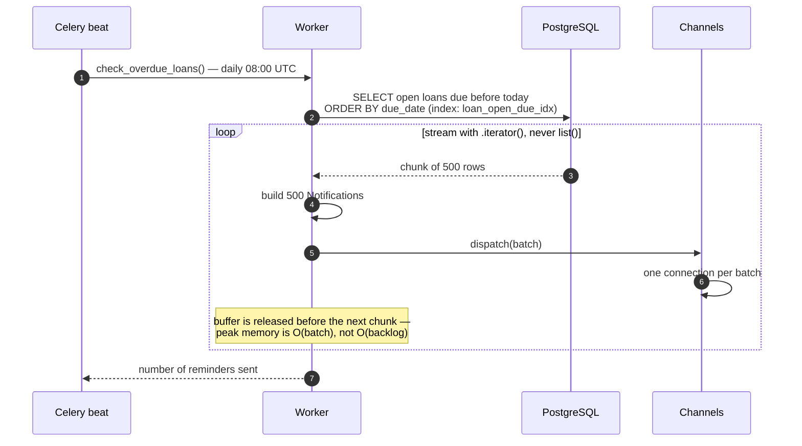

# Library Tracking System

A Django REST Framework service for a lending library: authors, books, members and
loans, with the loan lifecycle — borrow, return, extend, chase overdue — as its
subject. Loan confirmations and the nightly overdue sweep run on Celery. The whole
stack (PostgreSQL, Redis, API, Celery worker, Celery beat) comes up with one command,
already migrated and seeded.

The interesting part is not the CRUD. It is that the loan rules live in one
well-tested service layer rather than being smeared across viewsets, and that the
overdue job is written to survive a table it cannot fit in memory.

---

## Captured output

There is no UI to screenshot — this is a JSON API plus a worker — so the evidence is
real request/response pairs and real container logs. A full transcript, including the
boot, the error contract and the overdue job running, is in
[`docs/api-session.md`](docs/api-session.md). Three excerpts:

**Loaning a copy decrements stock and queues a confirmation**

```console
$ curl -s -u librarian:librarian http://localhost:8210/api/books/1/
{"title": "The Dispossessed", "available_copies": 3}

$ curl -s -u librarian:librarian -X POST http://localhost:8210/api/books/1/loan/ \
      -H 'Content-Type: application/json' -d '{"member_id": 2}'
{"status": "Book loaned successfully.", "loan_id": 11}

$ curl -s -u librarian:librarian http://localhost:8210/api/books/1/
{"title": "The Dispossessed", "available_copies": 2}
```

**Every rule violation answers with a human message and a stable machine code**

```console
$ ... POST /api/loans/6/extend_due_date/  -d '{"additional_days": 7}'   # an overdue loan
{"error":"Cannot extend an overdue loan.","code":"loan_overdue"}
HTTP 400

$ ... POST /api/loans/10/extend_due_date/ -d '{"additional_days": 7}'   # a returned loan
{"error":"Loan has already been returned.","code":"loan_already_returned"}
HTTP 400

$ ... POST /api/books/5/loan/             -d '{"member_id": 1}'         # no copies left
{"error":"No available copies.","code":"book_unavailable"}
HTTP 400
```

**The nightly overdue job, running on the worker**

```console
[2026-09-23 12:51:53,547: INFO/MainProcess] Task library.tasks.check_overdue_loans[6d74d82a] received
Subject: Overdue Book Loan
To: bo@example.com

Hello bo,

"Ancillary Justice" was due on 2026-09-12 (11 day(s) ago). Please return it.
-------------------------------------------------------------------------------
Subject: Overdue Book Loan
To: amara@example.com

Hello amara,

"Stiff" was due on 2026-09-19 (4 day(s) ago). Please return it.
-------------------------------------------------------------------------------
[2026-09-23 12:51:53,872: INFO/ForkPoolWorker-8] check_overdue_loans: sent 2 reminder(s)
[2026-09-23 12:51:53,889: INFO/ForkPoolWorker-8] Task ...check_overdue_loans[6d74d82a] succeeded in 0.277s: 2
```

The seed creates three overdue loans, but only two reminders went out: the third book
had just been returned, and overdue-ness is derived from current state rather than
read from a status column that someone has to remember to update.

---

## Architecture

The rule is one-directional: **HTTP and Celery are adapters, the service layer owns
the rules, and the rules depend only on the models.** `library/services/` imports
neither DRF nor Celery — which is precisely why the loan rules can be tested without
constructing a request or starting a broker.



### The loan state machine

`ACTIVE` and `OVERDUE` are both *open* loans; the difference is only whether today is
past `due_date`. Nothing writes `OVERDUE` — a date passing causes it. That is why
there is no scheduled job whose entire purpose is to keep a status column honest.



## Workflow

Borrowing a book, end to end — the one path that touches every layer:

```mermaid
sequenceDiagram
    autonumber
    participant C as Client
    participant V as BookViewSet<br/>(adapter)
    participant S as services.loans<br/>(rules)
    participant DB as PostgreSQL
    participant Q as Redis
    participant W as Celery worker
    participant CH as NotificationChannel

    C->>V: POST /api/books/1/loan/ {"member_id": 2}
    V->>S: resolve_member(2)
    S->>DB: SELECT member JOIN user
    alt member missing / blank / non-numeric
        S-->>V: MemberNotFound
        V-->>C: 400 {"code": "member_not_found"}
    end
    V->>S: loan_book(book, member)

    rect rgb(233, 247, 239)
        note over S,DB: one transaction, row-locked
        S->>DB: SELECT ... FOR UPDATE (book)
        alt no copies left on the shelf
            S-->>V: BookUnavailable
            V-->>C: 400 {"code": "book_unavailable"}
        end
        S->>DB: INSERT loan (due_date = today + 14)
        S->>DB: UPDATE book SET available_copies = available_copies - 1
    end

    V->>Q: send_loan_notification.delay(loan_id)
    V-->>C: 201 {"loan_id": 11}

    note over C,W: the client is already done; delivery is asynchronous
    Q->>W: deliver task
    W->>DB: SELECT loan JOIN book, member, user
    W->>CH: dispatch([Notification])
    CH->>CH: one SMTP connection for the whole batch
```

And the nightly sweep, which is the same rules driven by a schedule instead of a
request:



## Quickstart

### Docker (recommended)

```sh
docker compose up --build
```

That is the whole thing. It starts PostgreSQL, Redis, the API under gunicorn, a Celery
worker and Celery beat; applies migrations; and seeds a demo catalogue. No second
command, no manual `migrate`, no empty database.

| Service | URL |
|---------|-----|
| API root (DRF browsable) | <http://localhost:8210/api/> |
| Health check | <http://localhost:8210/health/> |
| Django admin | <http://localhost:8210/admin/> |
| PostgreSQL | `localhost:8211` |
| Redis | `localhost:8212` |

The seed creates a superuser `librarian` / `librarian` and five members
(`amara`, `bo`, `chen`, `dalia`, `evan`, password `library-demo`). **These are demo
credentials — set `LIBRARIAN_PASSWORD` and `SEED_MEMBER_PASSWORD` before exposing the
stack to anything.** Ten loans are seeded deliberately spanning all three states, so
`status`, the extension rules and the overdue job all have something real to act on
immediately.

Email is written to the console backend by default, so loan confirmations and overdue
reminders appear in `docker compose logs worker` without an SMTP server.

Tear down with `docker compose down -v`.

### Try it

```sh
curl -s http://localhost:8210/health/

# browse anonymously
curl -s 'http://localhost:8210/api/books/?page_size=3'

# writes need credentials
curl -s -u librarian:librarian -X POST http://localhost:8210/api/books/1/loan/ \
     -H 'Content-Type: application/json' -d '{"member_id": 1}'

# run the overdue sweep on demand instead of waiting for 08:00 UTC
docker compose exec web python -c "
from library_system.celery import app
print(app.send_task('library.tasks.check_overdue_loans').get(timeout=30))"
docker compose logs worker --since 60s
```

## Configuration

Every value is read from the environment; a `.env` file in the project root is loaded
automatically and is gitignored. [`.env.example`](.env.example) is a working template.
The Compose stack supplies defaults for all of these, so it boots without a `.env`.

| Variable | Required | Default | What it does |
|----------|----------|---------|--------------|
| `SECRET_KEY` | **yes when `DEBUG=0`** | — | Django signing key. Startup fails with `ImproperlyConfigured` if missing while `DEBUG` is off; a throwaway key is used in debug only. |
| `DEBUG` | no | `0` | Accepts `1/true/yes/on`. Off by default. |
| `DJANGO_ALLOWED_HOSTS` | no | `localhost 127.0.0.1 [::1]` | Space-separated host list. |
| `LOG_LEVEL` | no | `INFO` | Root log level. |
| `DB_ENGINE` | no | `django.db.backends.postgresql` | Set to `django.db.backends.sqlite3` for a file-backed local DB. |
| `POSTGRES_DB` | no | `library_db` | PostgreSQL only. |
| `POSTGRES_USER` | no | `library_user` | PostgreSQL only. |
| `POSTGRES_PASSWORD` | no | `library_password` | PostgreSQL only. Change it outside local development. |
| `DB_HOST` | no | `db` | PostgreSQL only (`db` is the Compose service name). |
| `DB_PORT` | no | `5432` | PostgreSQL only. |
| `SQLITE_NAME` | no | `<project>/db.sqlite3` | SQLite only. |
| `CELERY_BROKER_URL` | no | `redis://redis:6379/0` | Broker. |
| `CELERY_RESULT_BACKEND` | no | `redis://redis:6379/0` | Result backend. |
| `NOTIFICATION_CHANNELS` | no | `library.notifications.email.EmailChannel` | Comma-separated dotted paths to `NotificationChannel` subclasses. This is the extension seam. |
| `OVERDUE_NOTIFICATION_BATCH_SIZE` | no | `500` | How many overdue reminders `check_overdue_loans` buffers before flushing. Bounds the job's peak memory. |
| `EMAIL_BACKEND` | no | `django.core.mail.backends.console.EmailBackend` | Point at SMTP in production. |
| `DEFAULT_FROM_EMAIL` | no | `admin@library.com` | Sender address. |
| `CORS_ALLOW_ALL_ORIGINS` | no | `1` when `DEBUG`, else `0` | |
| `CORS_ALLOWED_ORIGINS` | no | empty | Comma-separated, used when the above is off. |
| `LIBRARIAN_USERNAME` / `LIBRARIAN_PASSWORD` | no | `librarian` / `librarian` | Demo superuser created by `seed_library`. |
| `SEED_MEMBER_PASSWORD` | no | `library-demo` | Password for seeded member accounts. |
| `RUN_MIGRATIONS` / `RUN_SEED` | no | `1` | Entrypoint switches. The worker and beat containers set these to `0` so exactly one process owns schema changes. |

## Development

Running without Docker, against SQLite — no PostgreSQL or Redis needed for the tests:

```sh
python3 -m venv project_venv
./project_venv/bin/pip install -r requirements-dev.txt

export DB_ENGINE=django.db.backends.sqlite3 DEBUG=1
./project_venv/bin/python manage.py migrate
./project_venv/bin/python manage.py seed_library      # same demo data as Docker
./project_venv/bin/python manage.py runserver
```

Celery needs a broker; with Redis on `localhost:6379`:

```sh
export CELERY_BROKER_URL=redis://localhost:6379/0
celery -A library_system worker -l info
celery -A library_system beat   -l info
```

**Tests** — Django's test runner, no extra dependencies, no services required:

```sh
DB_ENGINE=django.db.backends.sqlite3 DEBUG=1 python manage.py test
```

```
Ran 129 tests in 20.283s

OK
```

**Lint and format** — ruff, configured in [`pyproject.toml`](pyproject.toml):

```sh
ruff check .          # All checks passed!
ruff format --check . # 44 files already formatted
```

**Migrations** — `python manage.py makemigrations --check --dry-run` reports
`No changes detected`; the committed migrations are in sync with the models.

## Project structure

```
django-library-tracking-system/
├── docker-compose.yml           # db · redis · web · worker · beat, one command
├── Dockerfile                   # multi-stage; venv built then copied, non-root runtime
├── docker/
│   ├── entrypoint.sh            # migrate + seed, gated by RUN_MIGRATIONS / RUN_SEED
│   └── healthcheck_beat.py      # /proc scan; slim images have no pgrep
├── pyproject.toml               # ruff config (lint + format)
├── requirements.txt             # runtime deps
├── requirements-dev.txt         # runtime + ruff
│
├── library_system/              # Django project
│   ├── settings.py              # env-driven; fails loudly without SECRET_KEY in prod
│   ├── urls.py                  # DRF router at /api/, /health/, /admin/
│   └── celery.py                # Celery app + beat schedule
│
├── library/
│   ├── models.py                # Author · Book · Member · Loan
│   │                            # LoanStatus, LoanQuerySet, the indexes
│   ├── services/                # ── the domain layer: no DRF, no Celery ──
│   │   ├── loans.py             #    loan / return / extend, the state machine
│   │   ├── notifications.py     #    turns a Loan into a Notification
│   │   └── exceptions.py        #    DomainError hierarchy
│   ├── notifications/           # ── the extension seam ──
│   │   ├── base.py              #    Notification + NotificationChannel (ABC)
│   │   ├── email.py             #    the one channel shipped today
│   │   └── __init__.py          #    dispatch() + settings-driven registry
│   ├── views.py                 # HTTP adapters: parse, call a service, respond
│   ├── tasks.py                 # Celery adapters: send_loan_notification,
│   │                            # check_overdue_loans (streamed)
│   ├── api_errors.py            # DomainError → 400 {"error", "code"}
│   ├── serializers.py
│   ├── pagination.py            # page_size 10, max 100
│   ├── health.py                # /health/ — checks the DB, used by HEALTHCHECK
│   ├── admin.py
│   ├── migrations/              # 0001–0004 (0004 adds the indexes)
│   ├── management/commands/
│   │   └── seed_library.py      # idempotent demo data, all three loan states
│   └── tests/                   # 129 tests
│       ├── test_services.py     #    the rules, without HTTP
│       ├── test_operations.py   #    health endpoint + seed command
│       ├── test_notifications.py#    the channel seam
│       ├── test_tasks.py        #    both tasks, including scalability behaviour
│       ├── test_api_books.py    #    endpoints, permissions, query counts
│       ├── test_api_loans.py    #    extension rules, error contract
│       ├── test_models.py · test_serializers.py · factories.py
│
├── docs/api-session.md          # the full captured transcript
└── utils/                       # commit-message helpers for this repo's conventions
```

## Design notes

### Getting the rules out of the viewsets

The original exercise put loan, return and extend inside `BookViewSet` and
`LoanViewSet` as stacks of `if`-checks returning `Response({'error': ...}, 400)`. That
works, but the rules can only be exercised through an HTTP client, and each new caller
(an admin action, a management command, a bulk importer) has to re-implement them.

`library/services/loans.py` is now the only module that knows what those three verbs
mean. It imports the models and nothing else — **no DRF, no Celery** — which is what
makes `test_services.py` able to assert on the rules directly. The views shrank from
146 lines of branching to 70 lines of "parse, call, respond", and `tasks.py` calls the
same functions the HTTP layer does.

Two rules that are easy to get wrong and are now pinned by tests:

- **Return closes the member's *oldest* open loan.** A member may hold two copies of
  the same title; `.get()` would raise `MultipleObjectsReturned` on a perfectly legal
  library state.
- **A loan due *today* is still extendable.** Overdue is `due_date < today`, strictly.
  Off-by-one here is the difference between a fine and no fine.

### Errors as a contract, not as prose

Domain failures raise `DomainError` subclasses; `api_errors.domain_exception_handler`
is the single place that renders them as `400 {"error": ..., "code": ...}`. The message
is for a human, the `code` is what a client branches on. Adding a rule means adding an
exception class, not touching a view. Distinguishing `loan_already_returned` from
`loan_overdue` matters: they are different situations for the person at the desk, and
the previous code returned the same generic string for both.

### Scalability — the real bottleneck

The bottleneck in this application is not the CRUD endpoints. It is
`check_overdue_loans`, because it is the one operation whose cost grows with the whole
history of the library rather than with one request.

**1. The job used to load the entire backlog into memory.** It now streams with
`.iterator(chunk_size=…)` and flushes notifications every `OVERDUE_NOTIFICATION_BATCH_SIZE`
rows, so peak memory is a function of the batch, not the backlog. Measured on a table
with 100,000 overdue loans (`tracemalloc`, same machine, same data):

| Implementation | Reminders | Peak memory | Wall clock |
|---|---|---|---|
| Streamed (`.iterator()`, flush per batch) | 100,000 | **0.7 MiB** | 14.8 s |
| Materialised (`list(queryset)`) | 100,000 | **250.0 MiB** | 17.9 s |

That is ~357× less peak memory, and it is the difference between a worker that is
fine at 10× the current size and one that is OOM-killed. `.only()` restricts the
fetch to the five columns the message templates actually read. The whole scan is a
single query regardless of row count — asserted in
`test_scan_is_a_single_query_regardless_of_row_count`.

**2. The scan had no index to use.** `loan_open_due_idx` on `(is_returned, due_date)`
matches the job's predicate exactly, and leads with `is_returned` so that closed
loans — the overwhelming bulk of a mature table — are excluded from the range scan
rather than filtered afterwards. Measured on 200,000 loans of which 1% are currently
overdue (a realistic, healthy library):

| | Query plan | Time |
|---|---|---|
| With `loan_open_due_idx` | `SEARCH library_loan USING INDEX loan_open_due_idx` | **2.3 ms** |
| Without it | `SCAN library_loan` | **33.7 ms** |

~15× on a table this size, and the gap widens linearly as history accumulates, because
the unindexed version is O(all loans ever) while the indexed one is O(loans actually
overdue). Two further indexes cover the other two hot predicates: `loan_book_open_idx`
for "this member's oldest open loan for this book" (the return path) and
`loan_member_open_idx` for "everything this member is holding".

**3. N+1 on the list endpoints.** `LoanQuerySet.with_related()` joins book, author,
member and user in one go; `BookViewSet` selects the author. Listing a page of ten
loans is **two** queries — one `COUNT`, one joined `SELECT` — no matter how many
distinct authors and members appear on it. This is asserted rather than asserted-in-prose:
`assertNumQueries(2)` in both `test_api_books.py` and `test_api_loans.py`, so a future
serializer change that reintroduces N+1 fails the build.

**4. Unbounded list responses.** All list endpoints paginate (default 10, `page_size`
up to 100). Every model has a deterministic `Meta.ordering`, without which paginated
results can repeat or skip rows between pages.

**5. Connection churn in the mail path.** The old code called `send_mail()` per
member, opening an SMTP connection each time. `EmailChannel.deliver()` takes the whole
batch and sends it over one connection — which is why `NotificationChannel.deliver()`
accepts a *list*: batching is the default shape of the interface, not something each
channel has to remember to do.

**What was deliberately not done:** no caching layer, no read replicas, no sharding,
no Kubernetes. The catalogue is small, the writes are rare, and the queries are now
indexed and bounded. Adding infrastructure here would be decoration.

### Extensibility — one seam, the one that is actually needed

The realistic next request for a library system is *"can we also send SMS?"* — not a
new storage backend or a new protocol. So the seam is a notification channel registry:

```python
# settings.py / environment
NOTIFICATION_CHANNELS = 'library.notifications.email.EmailChannel,myapp.sms.SmsChannel'
```

A new channel is one class implementing `deliver(notifications)` plus one settings
entry. Nothing in `services/`, `views.py` or `tasks.py` changes, because callers build
a `Notification` and hand it to `dispatch()` — they never import a channel. The
`Notification` dataclass carries `kind` and `context` alongside the rendered `subject`
and `body` precisely so a future channel can re-render its own way; a push notification
has no use for a three-paragraph email body.

`dispatch()` also owns the "member has no email address" case once, rather than each
caller checking, and logs a warning if notifications are produced while no channel is
configured — so a misconfiguration is visible rather than silent. Both behaviours are
tested in `test_notifications.py`.

### Why `OVERDUE` is derived and not stored

Storing a status column would mean a scheduled job whose only purpose is to keep that
column truthful, and a window every day during which the database is lying. `status`
is a property computed from `is_returned` and `due_date`, `LoanQuerySet` exposes the
same predicate for querying, and the composite index makes the derived query cheap.
The captured output above shows the payoff: a book returned thirty seconds before the
sweep is simply not overdue, with no invalidation step anywhere.

### Container layout

The `Dockerfile` is multi-stage: dependencies are installed into a venv in a builder
stage and the venv is copied into a clean runtime image, so pip, its cache and the
build tooling never ship. The runtime runs as a non-root `app` user. Static assets are
baked at build time and served by WhiteNoise, so the running container needs no write
access and no second web server. `HEALTHCHECK` calls `/health/`, which checks database
connectivity rather than merely that the process is alive — and Compose uses those
health states as dependency conditions, which is why `up` needs no retry loop or
`wait-for-it` script.

`entrypoint.sh` migrates and seeds, gated by `RUN_MIGRATIONS` / `RUN_SEED`; the worker
and beat containers set both to `0`, so exactly one process owns schema changes even
though all three run the same image.

## Limitations

- **Authorisation is coarse.** `IsAuthenticatedOrReadOnly` means any authenticated
  user can act on any member's loans. There is no notion of "this member may only
  manage their own loans", and no librarian-vs-member role split. Fine for the
  exercise; the first thing to add for real use.
- **Authentication is session and HTTP Basic only.** No token or JWT issuance.
- **No fines, reservations, holds or renewal limits.** A member can extend an active
  loan indefinitely, and there is no cap on how many books one member may hold.
- **The overdue sweep is not idempotent per day.** Running it twice sends two
  reminders; it does not record that a member was already chased. A `last_notified_at`
  column would fix it, and was left out as scope beyond the exercise.
- **Only an email channel exists.** The seam for SMS/push is in place and tested, but
  no second channel is implemented.
- **The demo seed creates well-known credentials.** They exist so a reviewer can boot
  the stack and immediately make requests. Override them before running this anywhere
  reachable.
- **Single-node assumptions.** One worker queue, no task routing, no rate limiting, no
  retry/backoff policy on the notification tasks — a failed send is logged and lost
  rather than retried.
- **`reserve_copy` and `loan_book` are two paths to one outcome.** `POST /api/loans/`
  and `POST /api/books/{id}/loan/` both open a loan; the DRF router gives the former
  for free, so both are supported and both decrement stock, but a single entry point
  would be cleaner.
